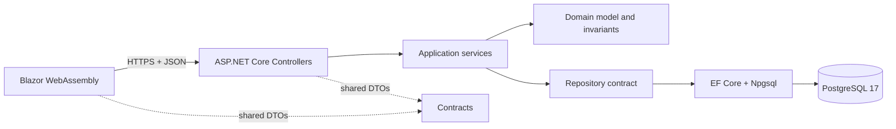

# Product Inventory Full Stack

[](https://github.com/mauri0686/product-inventory-fullstack/actions/workflows/ci.yml)
[](https://github.com/mauri0686/product-inventory-fullstack/actions/workflows/pages.yml)

A small inventory product built as a production-minded take-home: an ASP.NET Core 9 API backed by PostgreSQL and a standalone Blazor WebAssembly 9 client. It keeps the requested CRUD visible while demonstrating validation, domain constraints, observability, isolated tests, accessibility, and a reproducible deployment.

## Live demo

- Web: <https://mauri0686.github.io/product-inventory-fullstack/>
- API readiness: <https://mauri-product-inventory-api.onrender.com/health/ready>
- API documentation: <https://mauri-product-inventory-api.onrender.com/scalar/v1>

The free API can take about a minute to wake after inactivity. The demo is not an SLA-backed production service, and its free PostgreSQL instance expires 30 days after creation.

## What is included

- Complete create, read, update, and delete flow through Blazor → API → PostgreSQL.
- Immediate, case-insensitive client-side search while typing.
- Client-side column sorting and pagination over the loaded inventory, plus automatic dark mode.
- Progressive loading: the first batch renders immediately while the rest streams in; the dashboard reads exact totals from a dedicated `/summary` endpoint.
- Server-side search, active status and price filters, sorting, and pagination.
- Dashboard for total products, active products, and total inventory value.
- A case-insensitive unique-name domain rule, enforced before persistence and by a database index.
- Consistent `ProblemDetails`, structured JSON logs, trace IDs, and live/ready health checks.
- Per-client rate limiting on the public API, with health checks exempt.
- Exactly 100 deterministic demo products created through EF Core 9 seeding.
- Unit, PostgreSQL integration, bUnit component, and deployed Playwright smoke tests.
- GitHub Actions quality gates, GitHub Pages delivery, Docker, and Render infrastructure as code.

## Architecture



Dependencies point inward. `Domain` has no project dependencies; `Application` owns use cases and persistence ports; `Infrastructure` implements those ports with EF Core; `Api` is the composition root. The WebAssembly client references only the DTO contract project and never the domain or persistence layers.

This deliberately avoids MediatR, CQRS, AutoMapper, a generic repository, an extra unit-of-work wrapper, and microservices. Those abstractions would add indirection without reducing risk for this bounded product.

## Prerequisites

- [.NET SDK 9.0.306](https://dotnet.microsoft.com/download/dotnet/9.0) or a newer 9.0 patch in the same feature band
- [Docker Desktop](https://www.docker.com/products/docker-desktop/) for PostgreSQL and integration tests
- Any current browser

All projects target exactly `net9.0`. Windows PowerShell and macOS/Linux commands are shown below.

## Run locally

Start PostgreSQL from the repository root:

```bash
docker compose up -d postgres
dotnet tool restore
dotnet restore ProductInventory.sln
```

Start the API and allow migrations only for this local demo process.

PowerShell:

```powershell
$env:AUTO_MIGRATE = "true"
$env:SeedDemoData = "true"
dotnet run --project src/ProductInventory.Api --launch-profile http
```

macOS/Linux:

```bash
AUTO_MIGRATE=true SeedDemoData=true \
  dotnet run --project src/ProductInventory.Api --launch-profile http
```

In a second terminal:

```bash
dotnet run --project src/ProductInventory.Web --launch-profile http
```

Open <http://localhost:5247>. The API listens on <http://localhost:5048>; local API docs are at <http://localhost:5048/scalar/v1>.

To reset local data, stop the stack and explicitly remove only this Compose volume:

```bash
docker compose down --volumes
```

## API

| Method | Route | Purpose |
|---|---|---|
| `GET` | `/api/products` | Search, filter, sort, and page products |
| `GET` | `/api/products/{id}` | Fetch one product |
| `GET` | `/api/products/summary` | Fetch whole-inventory metrics |
| `POST` | `/api/products` | Create; returns `201` and `Location` |
| `PUT` | `/api/products/{id}` | Update; returns the canonical product |
| `DELETE` | `/api/products/{id}` | Delete; returns `204` |
| `GET` | `/health/live` | Process liveness |
| `GET` | `/health/ready` | PostgreSQL readiness |

List query parameters:

```text
search, isActive, minPrice, maxPrice,
sortBy=name|price|quantity|isActive,
sortDirection=asc|desc, page, pageSize
```

`page` starts at 1 and `pageSize` is limited to 1–100. Invalid query combinations return `400 application/problem+json`.

### Validation and domain rule

- `Name`: required after trimming, maximum 100 characters.
- `Price`: greater than zero.
- `Quantity`: zero or greater.
- `Name`: unique regardless of case.

The name rule is checked in the application service for a clear `409 product.name_conflict`, then guaranteed by a unique index on the normalized name. That second check closes concurrent-write races.

## Migrations and seed

The initial EF Core migration is committed under `Infrastructure`. Startup migrations are disabled unless `AUTO_MIGRATE=true`; this prevents an arbitrary production process from changing schema unexpectedly. The Render demo opts in because its free tier does not provide a separate pre-deploy migration job.

EF Core 9 `UseSeeding` and `UseAsyncSeeding` create exactly 100 deterministic products when `SeedDemoData=true` and the table is empty. The seed is idempotent.

Create a future migration with:

```bash
dotnet ef migrations add MeaningfulName \
  --project src/ProductInventory.Infrastructure \
  --startup-project src/ProductInventory.Api
```

## Tests and quality checks

```bash
dotnet format ProductInventory.sln --verify-no-changes
dotnet build ProductInventory.sln --configuration Release
dotnet test tests/ProductInventory.UnitTests --configuration Release
dotnet test tests/ProductInventory.Web.Tests --configuration Release
dotnet test tests/ProductInventory.IntegrationTests --configuration Release
dotnet list ProductInventory.sln package --vulnerable --include-transitive
```

Integration tests start their own PostgreSQL 17 Testcontainer, apply the real migration, and never use development or production data. Docker must be running. CI publishes TRX and Cobertura coverage artifacts for every run.

The deployed smoke test creates a uniquely named product, edits it, searches for it, deletes it, and verifies the dashboard returns to its baseline. It uses accessible roles and labels rather than timing sleeps or brittle selectors.

## Client behavior

The WebAssembly `HttpProductRepository` is the only place with the challenge-required `Task.Delay(500)`. Each public repository operation supports cancellation. The API, application layer, EF Core, seeding, and tests contain no artificial latency.

The client loads the inventory progressively: the first batch renders immediately and the remaining pages stream in the background behind a "loading more" indicator, so the user is not blocked on a full load. The dashboard reads exact totals from the dedicated `/summary` endpoint, so it is correct before every row has arrived. Search then filters the in-memory view immediately and case-insensitively; it does not issue a delayed request on each keystroke. Column sorting and pagination also run in the browser over the loaded collection, so the table stays responsive and the mobile view is not one long scroll. Dashboard figures always describe the complete collection, not the filtered view. PostgreSQL remains the only source of truth, so browser storage is intentionally absent.

## Deployment

- `.github/workflows/ci.yml` restores locked dependencies, verifies formatting, builds with warnings as errors, runs all tests with coverage, audits vulnerable packages, and checks for an uncommitted EF model change.
- `.github/workflows/pages.yml` runs only after a green CI revision, publishes standalone WebAssembly, sets the project-site base path, adds `.nojekyll` and a `404.html` fallback, then deploys through GitHub Pages.
- `render.yaml` defines one free Docker web service and one free PostgreSQL 17 database in the same region. Render deploys only after linked checks pass.
- CORS accepts only configured localhost origins and `https://mauri0686.github.io`; credentials and wildcard origins are disabled.
- The public API applies a per-client fixed-window rate limit; health checks are exempt and the test environment is not throttled.

No credentials are committed. `DATABASE_URL` is injected from the Render database resource.

## Trade-offs and limitations

- The public demo has cold starts and temporary free-tier storage. It is evidence, not a production SLA.
- A single API instance can safely run the opt-in demo migration because EF Core 9 migration locking protects the seeding operation. A real production deployment would run migrations as a separate release step.
- Loading the whole inventory is intentional for the small dashboard/search exercise. At larger scale, search and aggregates would stay server-side and the UI would page only the current view.
- Authentication, offline persistence, bulk operations, optimistic concurrency, distributed tracing, caching, and API versioning are out of scope.

## Originality and references

The implementation was written for this repository. Reference projects were used to compare boundaries, test strategy, and hosting—not as source material to copy.

- [Microsoft: common web application architectures](https://learn.microsoft.com/en-us/dotnet/architecture/modern-web-apps-azure/common-web-application-architectures)
- [Microsoft .NET 9 eShop](https://github.com/dotnet/eShop/tree/94e2643dc73b0be47cb956bd79af9863b87df845)
- [Jason Taylor Clean Architecture, .NET 9 branch](https://github.com/jasontaylordev/CleanArchitecture/tree/net9.0)
- [Official Blazor samples](https://github.com/dotnet/blazor-samples)
- [bUnit](https://github.com/bUnit-dev/bUnit)

The final quality review and requirement trace are recorded in [`docs/quality-report.md`](docs/quality-report.md).
